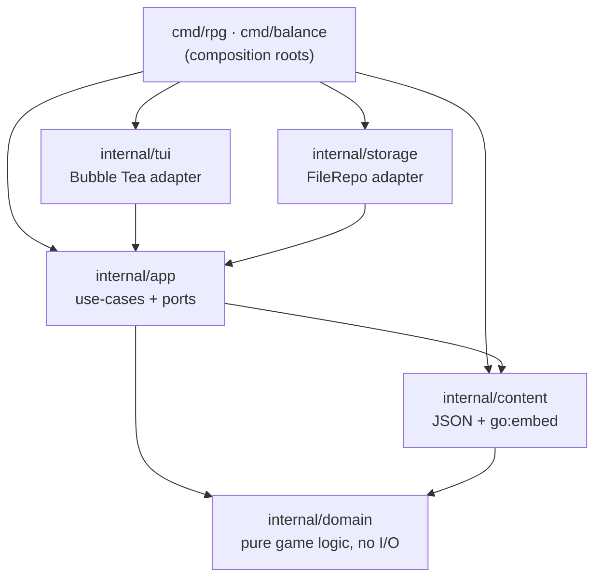

# AzureNights

A moddable terminal JRPG **engine**, written in Go. Walk an emoji overworld in
real time, get pulled into turn-based battles, advance a Lineage-2-style class
tree, take sides in a rock-paper-scissors faction triangle, and follow quests —
then fork it and build your own world by editing JSON, no Go required.

The game is one artifact; the engine underneath is the point.

```
🌲🌲🌲🌲🌲🌲🌲🌲🌲🌲
🌲🌿🌿🌿🌿🌿👹🌿🌿🌲
🌲🌿🌿🌿🌊🌿🌿🌿🚪🌲
🌲🌿🌿🌿🔥🌿🌿🌿🌿🌲
🌲🌿🌿🌊🌿🌿🌿🌿🌿🌲
🌲🧝🌿🌿👹🌿🌿💀🌿🌲
🌲🌲🌲🌲🌲🌲🌲🌲🌲🌲
```

## Quickstart

```bash
go run ./cmd/rpg          # play
make run                  # same, via Make
make test                 # full suite, race detector on
make balance              # headless balance report (see below)

docker build -t azurenights .
docker run --rm -it azurenights
```

Controls: arrows / WASD to move, `enter` to act in battle, `c` for the character
menu (class advancement + equipment), `ctrl+s` to save, `q` to quit.

## It's an engine, not a fixed game

Every piece of content lives as JSON under `internal/content/data/` and is
embedded into the binary at build time. Add a class, a faction, an enemy, a map,
or a quest by editing JSON — then `go build`. Everything is validated at load,
so a dangling reference fails fast at startup with a clear message instead of
crashing mid-game.

See **[docs/MODDING.md](docs/MODDING.md)** for the full guide. Re-tuned the
combat numbers? Run `make balance` to see the new win-rates measured **through
the real engine**, not a separate spreadsheet.

## Architecture

AzureNights follows a hexagonal (ports & adapters) layout. The dependency arrow
points **inward**: adapters depend on the application layer, the application
layer depends on content and the domain, and the domain depends on nothing but
the standard library. Nothing reaches back out.



| Layer | Package | Responsibility |
|------|---------|----------------|
| Domain | `internal/domain/stats` | Primary → derived combat stats (incl. DEX-based crit) |
| Domain | `internal/domain/class` | Advancement tree, cumulative attributes, level gates |
| Domain | `internal/domain/character` | Binds class + level + gear into effective stats |
| Domain | `internal/domain/item` | Equippable gear and its bonuses |
| Domain | `internal/domain/combat` | Turn machine, damage (variance/crit/faction), skills, AI |
| Domain | `internal/domain/world` | Tile maps, movement, day/night + weather clock |
| Domain | `internal/domain/faction` | Rock-paper-scissors triangle and damage multipliers |
| Domain | `internal/domain/quest` | Objectives, progress rules, completion |
| Content | `internal/content` | Validates JSON into typed registries (`//go:embed`) |
| Application | `internal/app` | `Session` use-cases + `Repository` port + view-models |
| Adapter | `internal/storage` | `FileRepo`: atomic JSON saves (temp file + rename) |
| Adapter | `internal/tui` | Bubble Tea / Lip Gloss terminal UI (Elm/MVU) |

### Design choices worth calling out

- **Deterministic by injection.** Randomness and time are never reached for
  inside the domain — the combat engine takes an RNG, the world clock takes a
  roll function. Production passes `rand`; tests pass a stub and assert exact
  outcomes. The concurrency boundary is Bubble Tea's command/message loop, so
  game state mutates in exactly one place, lock-free.
- **CQRS-lite view-models.** The TUI reads flat presentation structs
  (`HeroView`, `BattleView`, `QuestLog`) and mutates only through use-cases. It
  never imports a domain stat type, so the UI and the rules evolve independently.
- **Data/mechanism split.** Domain packages own the *rules*; all *data* is JSON.
  `class.NewTree`, `faction.NewTable`, `quest.NewSet`, and the map parser each
  validate their input at load, turning malformed content into a startup error.
- **One engine, two front ends.** Because the rules are a pure, I/O-free core,
  `cmd/balance` runs thousands of duels through the *same* `combat.Battle` the
  game uses and prints class / faction / enemy win-rate tables. The balancer can
  never disagree with what a player feels — it isn't a model of the engine, it
  *is* the engine, headless.

### Testing

Every domain package is unit-tested table-style; the application and adapter
layers are integration-tested against loaded content with a fake repository and
an injected RNG. The suite runs under `-race`. CI additionally enforces `gofmt`,
`go vet`, and a balance smoke run.

## Project layout

```
.
├── cmd/
│   ├── rpg/          # composition root: wires content + app + storage + tui
│   └── balance/      # headless duel harness over the real combat engine
├── internal/
│   ├── domain/       # pure game logic, no I/O
│   │   ├── stats/ class/ character/ item/
│   │   └── combat/ world/ faction/ quest/
│   ├── content/      # JSON + go:embed -> validated registries
│   │   └── data/     # classes, skills, items, enemies, factions, quests, maps
│   ├── app/          # use-cases (Session) + ports (Repository) + view-models
│   ├── storage/      # FileRepo adapter (atomic JSON saves)
│   └── tui/          # Bubble Tea terminal adapter
├── docs/MODDING.md
├── Dockerfile
└── Makefile
```

## Tech

Go 1.23 · [Bubble Tea](https://github.com/charmbracelet/bubbletea) ·
[Lip Gloss](https://github.com/charmbracelet/lipgloss) · standard library only
for the domain.

## Where it could go next

The application layer already defines its boundary as the `Repository` port and
talks to the world only through use-cases — so an HTTP or gRPC adapter could sit
beside the TUI and serve the *same* engine over the network without touching a
line of game logic. That's the payoff of keeping the core pure.

## License

MIT.