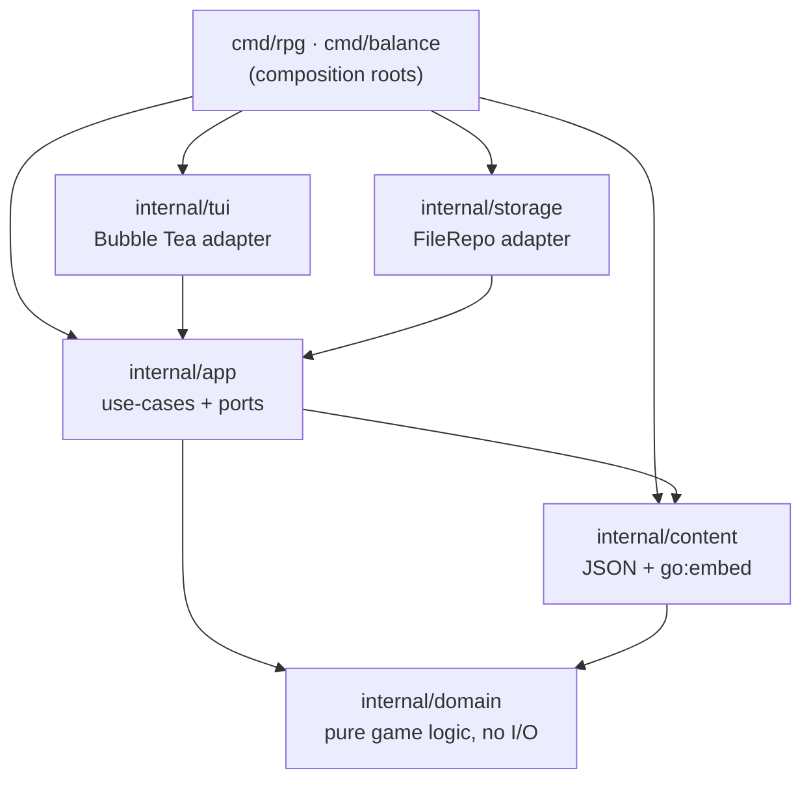

# AzureNights

A moddable terminal JRPG **engine** in Go — emoji overworld, turn-based combat, a
Lineage-2-style class tree, a faction triangle, quests, and a living day/night world.

[](https://github.com/uinjad/AzureNights2/actions/workflows/ci.yml)
[](https://github.com/uinjad/AzureNights2/releases)
[](https://goreportcard.com/report/github.com/uinjad/AzureNights2)
[](LICENSE)

This is a portfolio project: the point is the **engine and its architecture**, and
the game is the demo that exercises it. It's a moddable engine with a playable demo,
not a content-rich game.

**Goals** — a pure, I/O-free domain (time and randomness injected); a strict
inward dependency arrow; content as data (JSON + `go:embed`), so a new class,
enemy, map, or quest is a data change validated at load, not new code; one engine
behind multiple front ends; tests under `-race` with gofmt/vet gates and
reproducible release builds.
**Non-goals** — deep balanced gameplay and a graphical client. Combat and
progression exist to drive the systems; the TUI is just one adapter.

## Quickstart

```bash
go run ./cmd/rpg          # play
make test                 # full suite, race detector on
make balance              # headless balance report through the real engine
docker run --rm -it azurenights
```

Controls: arrows/WASD to move, `enter` to act in battle, `c` for the character
menu (advancement, gear, quests), `ctrl+s` to save, `q` to quit.

## Architecture

Hexagonal (ports & adapters). The dependency arrow points **inward**: adapters
depend on the app, the app on content and the domain, the domain on nothing but
the standard library.



Design highlights worth a look:

- **Deterministic by injection** — the combat engine takes an RNG and the world
  clock takes a roll function; production passes `rand`, tests pass a stub and
  assert exact outcomes.
- **One engine, two front ends** — `cmd/balance` runs thousands of duels through
  the *same* `combat.Battle` the game uses and prints win-rate tables. An HTTP
  adapter could sit beside the TUI over the same ports without touching game logic.
- **Validation at load** — malformed content (a dangling skill, an unknown enemy,
  a portal to nowhere) fails at startup with a clear error, not mid-game.
- **CQRS-lite view-models** —